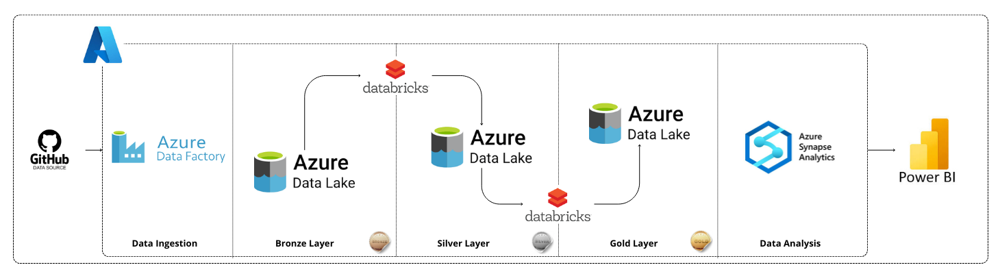
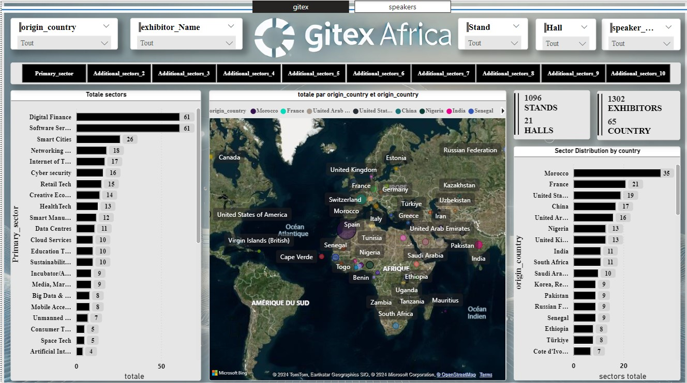
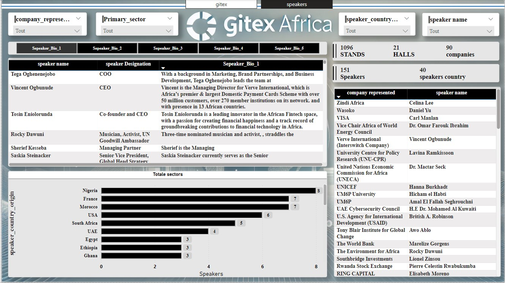

# 🚀 Gitex Africa Azure Project

## 📚 Project Overview
The **Gitex Africa Azure Project** is a demonstration of a modern data engineering pipeline. It leverages **Microsoft Azure** services to collect, transform, and analyze data, presenting insights through **Power BI dashboards**. The project showcases expertise in **data ingestion**, **transformation**, and **visualization** using cutting-edge technologies.

---

## 🏗️ Architecture Overview
The data pipeline architecture is designed with scalability and efficiency in mind. Below is the complete architecture of the project:

### 🔑 Key Components:
1. **Data Ingestion**: Data is sourced from GitHub using **Azure Data Factory**.
2. **Bronze Layer**: Raw data is stored in **Azure Data Lake**, capturing all details as-is for traceability.
3. **Silver Layer**: Data undergoes cleaning and transformation using **Azure Databricks**, creating a semi-processed dataset.
4. **Gold Layer**: Fully processed, enriched data is stored for reporting and analysis.
5. **Data Analysis**: Data is loaded into **Azure Synapse Analytics** for advanced analysis and querying.
6. **Visualization**: Insights are presented through **Power BI dashboards**.

---

## 📊 Dashboards
### 1️⃣ **First Dashboard**  
This dashboard is dedicated to general analytics on Gitex information across various dimensions. It provides a high-level overview of the key metrics and trends.

### 2️⃣ **Second Dashboard**  
This dashboard focuses on a deeper analysis and is specifically dedicated to insights about the speakers at Gitex. It includes detailed metrics and tailored visualizations.

---

## 🛠️ Technologies Used
- **Azure Data Factory**: For orchestrating data ingestion workflows.
- **Azure Data Lake**: To store data at different stages (bronze, silver, gold).
- **Azure Databricks**: For data transformation and processing.
- **Azure Synapse Analytics**: For running complex queries and data analysis.
- **Power BI**: To create interactive dashboards for data visualization.
- **GitHub**: As the primary source of the raw data.

---

## 🎯 Objectives Achieved
- **End-to-End Data Pipeline**: Covers data ingestion, transformation, and visualization.
- **Scalable Architecture**: Built on Azure services to handle large datasets.
- **Interactive Dashboards**: Provides actionable insights for decision-making.
- **Automation**: Automates data workflows using Azure tools.
- **Cloud-Based**: Leverages the scalability and reliability of Azure cloud services.
